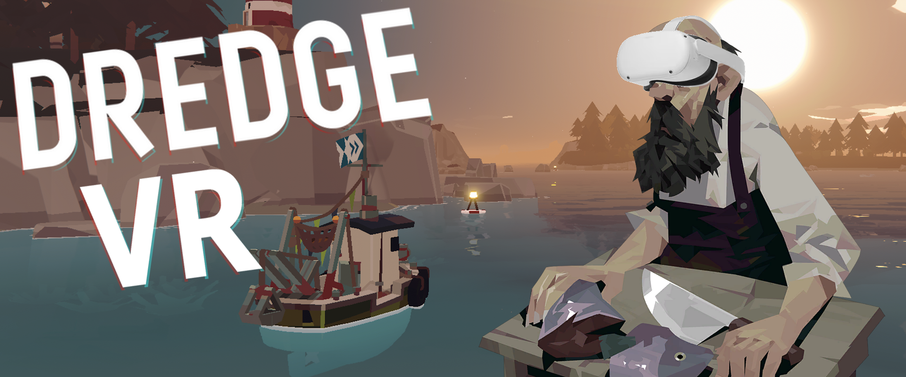

# Dredge VR

It makes the game VR.

This mod uses the mod loader and manager available on [dredgemods.com](https://dredgemods.com/)

This mod uses SteamVR so you have to have Steam installed to use it. In theory it will work on non-Steam versions of the game but I haven't tested it.

Has built in controller bindings for Oculus and Valve Index. You might have to set up your own bindings for other controllers.

## Thanks:
Thank you [Raicuparta](https://github.com/Raicuparta) for the advice and resources, and to [PinkMilkProductions](https://youtu.be/qT-V59Yw6UY?si=WKBkwutwuEEbHlDN) for the tutorials.

Thank you Black Salt Games for the cool game, was a lot of fun making it VR.

This mod is in no way affiliated with Black Salt Games or Team 17.

## Credits:
- Custom prompts font was Microsoft YaHei UI (note to self if I need to draw more)
- Uses free prompts by Xelu
